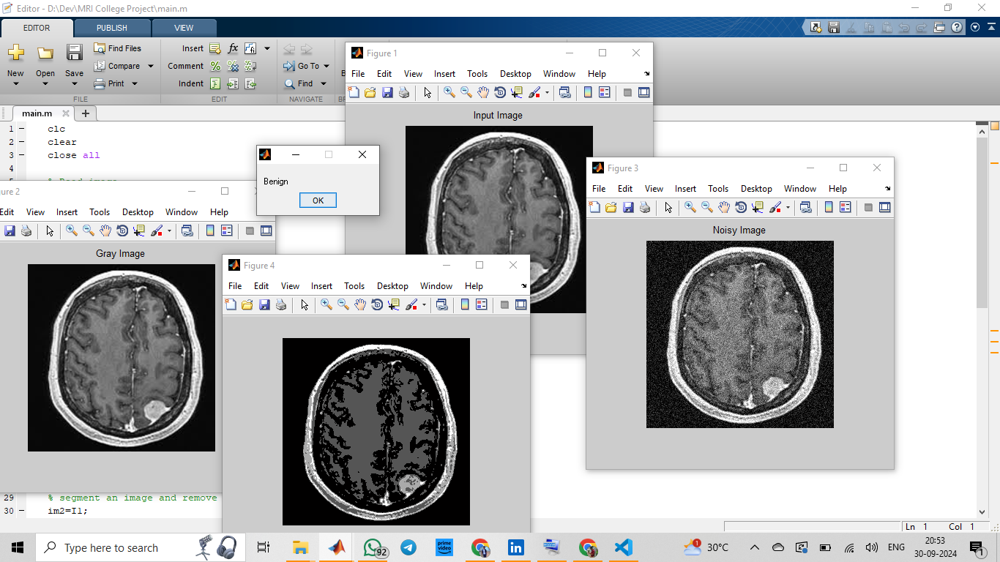
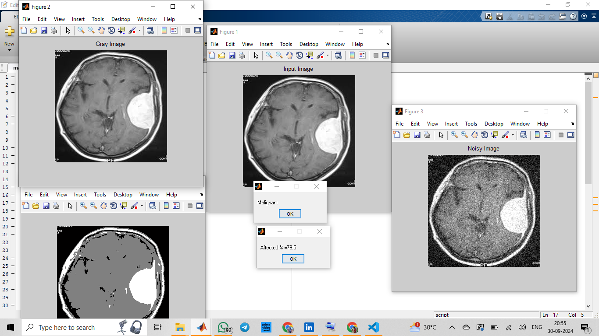
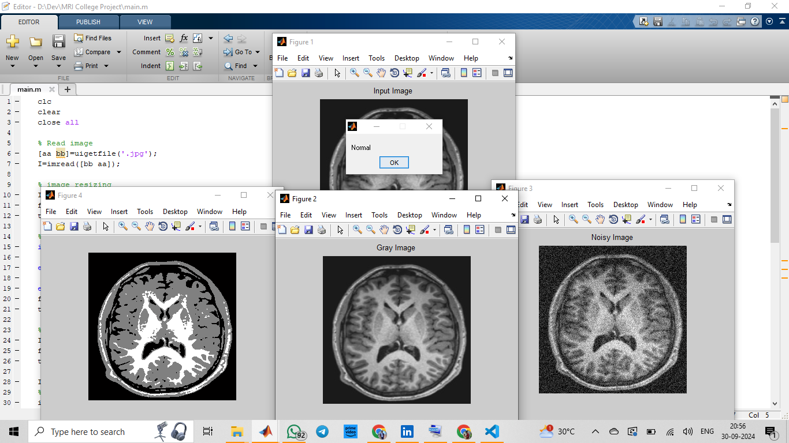

### Identification of Malignancy in Brain MRI
### Deep Learning Project
• Created a model achieving 85% accuracy in detecting malignancies from 1,000+ MRI images.
• Boosted detection rates by 20% through optimized model training; employed Python for advanced image processing.
• Collaborated to enhance data preprocessing techniques, significantly improving model performance.
• Presented project findings at a local tech seminar, gaining feedback from industry professionals
 
Some Sample Screenshots are attached below

